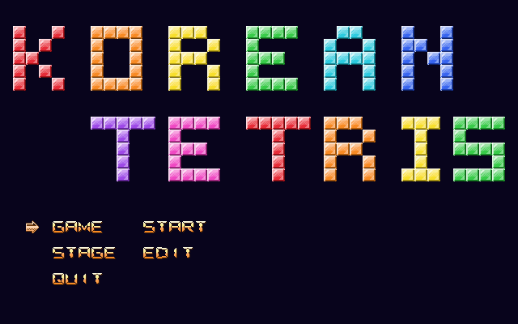
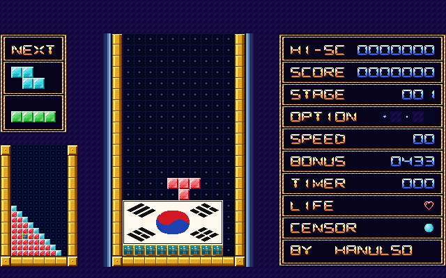
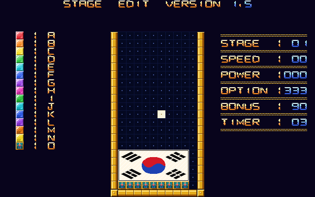
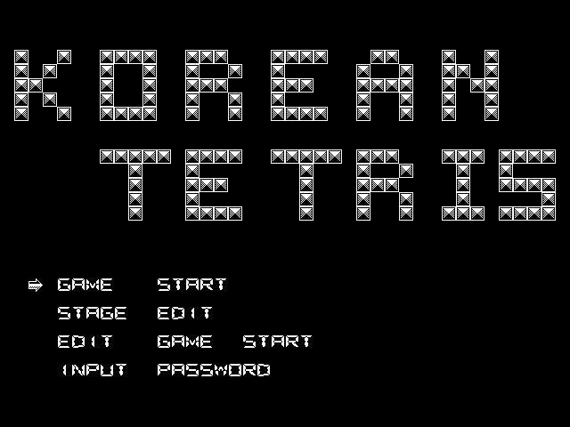

# 코리아 (KOREA) — 1990년 국산 도스 게임 되살리기

**코리아**는 1990년 PARK S.G. 님이 만든 국산 테트리스 게임입니다.

이 프로젝트는 원판 실행 파일 `KOREA.EXE` 를 역어셈블해서 C 언어 코드로 다시 옮긴 것입니다. 그리고 그 코드를 바탕으로 **화면은 컬러로, 음악은 애드립 사운드로**
새로 꾸민 판도 함께 만들었습니다.

| 프로그램 | 어떤 판인가요 |
| --- | --- |
| `KOREA.EXE` | 1990년 원판을 그대로 재현. 흑백 화면, 컴퓨터 본체 스피커의 "삑삑" 소리 |
| `KOREAVGA.EXE` | 새로 꾸민 판. 256색 그림, 애드립 배경음악, 블록이 부드럽게 움직임 |

두 판 모두 게임 규칙, 스테이지 100개, 속도는 원판과 똑같습니다.

## 화면

| 첫 화면 (컬러판) | 게임 중 (컬러판) |
| --- | --- |
|  |  |

| 스테이지 편집기 (컬러판) | 첫 화면 (1990년 원판) |
| --- | --- |
|  |  |

## 어떤 게임인가요

위에서 떨어지는 블록을 쌓아 가로 줄을 채우면 그 줄이 사라지는 **테트리스**입니다.
여기에 한 가지가 더 있습니다.

- 판 곳곳에 **사람이 갇혀** 있습니다. 줄을 지워서 사람을 모두 구하면 다음 스테이지로 넘어갑니다.
- 가끔 블록 대신 **아이템**(로켓, 폭탄, 레이저, 터보)이 떨어집니다.
- 시간이 지나면 판이 옆으로 밀리거나 벽돌이 생기는 등 **방해 효과**가 일어납니다.
- 스테이지는 100개이고, 게임 안의 **편집기**로 직접 고치거나 새로 만들 수 있습니다.

### 조작

| 키 | 하는 일 |
| --- | --- |
| ← → | 블록 옮기기 |
| ↓ | 한 칸 내리기 |
| ↑ 또는 숫자판 5 | 블록 돌리기 |
| Space | 바닥까지 한 번에 떨어뜨리기 |
| F1 | 배경음악 켜기/끄기 |
| Esc | 끝내기 |

## 해 보는 방법

요즘 컴퓨터(윈도우)에서는 도스 프로그램이 바로 돌지 않으므로 **DOSBox** 라는 무료 도스 흉내 프로그램을 씁니다.

1. [DOSBox](https://www.dosbox.com/) 를 설치합니다.
2. 이 저장소의 `release` 폴더 안에 있는 `KOREAVGA` (컬러판) 또는 `KOREA` (원판) 폴더를 준비합니다.
3. DOSBox 를 켜고 다음처럼 입력합니다. (`C:\games\KOREAVGA` 는 폴더를 둔 곳으로 바꾸세요)

   ```
   mount c C:\games\KOREAVGA
   c:
   koreavga
   ```

   원판은 마지막 줄에 `korea` 라고 칩니다.

폴더 안 파일은 지우지 말고 함께 두어야 합니다. 특히 `CWSDPMI.EXE` 는 프로그램을 돌리는 데 꼭 필요한 보조 프로그램입니다.

## 컬러판에서 달라진 점

- 흑백 그림 256개를 하나하나 색칠했습니다 (유리 벽돌, 태극기, 금색 테두리 등).
- 첫 화면 "KOREAN TETRIS" 글자를 한 글자씩 다른 색으로 칠했습니다.
- 배경음악을 새로 편곡했습니다. 메뉴에서는 록 버전 아리랑, 게임 중에는 테트리스 음악으로 유명한
  러시아 민요 코로베이니키와 아리랑 메들리가 나옵니다. 두 곡 모두 저작권이 없는 민요입니다.
- 블록이 칸에서 칸으로 툭툭 끊기지 않고 미끄러지듯 움직입니다.
- 원판 메뉴에 있던 만들다 만 항목 두 개를 "끝내기(QUIT)"로 바꿨습니다.

## 어떻게 만들었나요

원판 실행 파일 끝에는 운 좋게도 개발 당시의 디버그 정보가 남아 있었습니다.
덕분에 원래 소스 파일 이름, 함수 이름, 변수 이름, 몇 번째 줄이었는지까지 알아낼 수 있었습니다.
이것을 길잡이로 기계어를 한 줄씩 읽어 C 코드로 다시 썼습니다.

원판은 1990년 당시의 그래픽 카드(허큘리스, CGA)를 직접 다루도록 만들어져 있어서
요즘 환경에서는 화면이 나오지 않습니다. 그래서 "화면 그리기"와 "소리 내기" 부분만 따로 떼어
갈아 끼울 수 있게 만들었습니다.

```
          ┌───────────────────────────┐
          │  게임 규칙 (두 판이 같이 씀) │
          └─────────────┬─────────────┘
          ┌─────────────┴─────────────┐
   원판 화면 + 스피커 소리        컬러 화면 + 애드립 음악
      = KOREA.EXE                  = KOREAVGA.EXE
```

## 개발자를 위한 정보

### 빌드

도스용 C 컴파일러 **djgpp** 가 필요합니다.

```
make -f korea.mak          # 두 판 모두
make -f korea.mak mono     # 원판 KOREA.EXE 만
make -f korea.mak vga      # 컬러판 KOREAVGA.EXE 만
make -f korea.mak clean    # 빌드 결과 지우기
```

그림·음악 데이터와 배포 폴더는 파이썬 스크립트로 만듭니다.

| 명령 | 하는 일 |
| --- | --- |
| `python tools/mkspr256.py` | 원판 흑백 그림 `KOREA.PTN` 을 색칠해 `KOREA256.SPR` 생성 |
| `python tools/mkmusic.py` | 배경음악과 효과음을 만들어 `SOUND.DAT` 하나로 묶음 |
| `python tools/mkrelease.py` | `release/` 배포 폴더와 zip 생성 |
| `python tools/shot.py` | DOSBox 로 게임을 띄워 `docs/` 스크린샷 촬영 |

### 소스 파일

괄호 안은 1990년 원래 소스 파일 이름입니다.

| 파일 | 하는 일 |
| --- | --- |
| `korea.c` (KOREA.C) | 프로그램 시작점, 게임 진행 순서 |
| `game.c` (KOR-INT.C) | 블록 떨어뜨리기, 줄 지우기, 스테이지 클리어 등 게임 진행 |
| `board.c` (KOR-SUB.C) | 판과 점수판 그리기, 충돌 판정, 아이템, 방해 효과 |
| `menu.c` (KOR-TIT.C) | 첫 메뉴 |
| `editor.c` (KOR-STG.C) | 스테이지 편집기 |
| `text.c` (KOR-GRP.C) | 글자 찍기 |
| `system.c` (KOR-SUB.C) | 파일 읽기/쓰기, 키보드, 시계 |
| `data.c` | 원판에서 뽑아낸 표 (화면 배치, 블록 모양, 악보) |
| `vidmono.c` / `vid256.c` | 원판 흑백 화면 / 컬러 화면 |
| `music.c` / `musvgm.c` | 스피커 소리 / 애드립 음악 |
| `korea.h` | 공통 선언. 원래 함수·변수 이름 대조표가 주석으로 들어 있음 |
| `listing.asm` | 원판 실행 파일을 풀어 놓은 기계어 목록 (설명 주석 포함) |

각 함수 위에는 원래 이름과 위치를 `원래: 이름 (파일:줄, 코드 위치)` 형식으로 적어 두었고,
원판에 없던 코드는 `(새로 넣음)` 으로 표시했습니다.

### 데이터 파일

| 파일 | 크기 | 내용 |
| --- | --- | --- |
| `KOREA.PTN` | 8 KB | 1990년 원본. 16x16 흑백 그림 256개 (그림 하나당 32바이트) |
| `KOREA.STG` | 20 KB | 1990년 원본. 스테이지 100개. 하나당 205바이트 = 판 지도 20x10칸 + 설정 5바이트(떨어지는 속도, 아이템, 방해 효과 종류, 보너스, 방해 간격) |
| `KOREA256.SPR` | 65 KB | 컬러 그림. 머리말 `KOR256S` 8바이트 + 256색 팔레트 768바이트 + 16x16 그림 256개 |
| `SOUND.DAT` | 30 KB | 음악 묶음. 머리말 `KRSND10` 8바이트 + 곡 수 + 곡 목록(이름, 위치, 길이) + 애드립 악보(VGM) 5곡 |

## 원작자

원작 게임은 1990년 PARK S.G. 님의 작품입니다. 이 프로젝트는 옛 국산 게임을 보존하고
기록하기 위해 만들었습니다.
